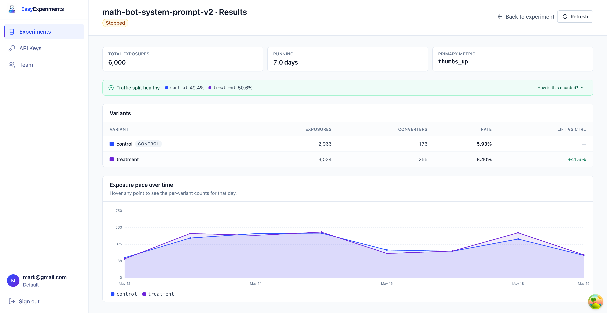

# Easy Experiments

**Self-hosted A/B testing tool that runs on a $5 VPS**

[Website](https://easy-experiments.dev) · [Docs](https://easy-experiments.dev/docs) · [Demo](https://app.easy-experiments.dev)



A lightweight LaunchDarkly / Amplitude etc. alternative. One Docker container, your data on your box, without a $5,000/month bill

## Why

- **Cheap** Runs on a $5 VPS. The hosted demo holds at 5k rps on that box
- **Minimal** Experiments and a results dashboard. Just enough to answer the question: "Should I launch this?"
- **Honest stats** Server-side exposure dedup, deterministic variant assignment, and sample-ratio-mismatch checks are built in

## Quickstart

```bash
docker run -d -p 18200:18200 \
  -e JWT_SECRET=$(openssl rand -hex 32) \
  -e ADMIN_EMAIL=you@example.com \
  -e ADMIN_PASSWORD=changeme \
  -v ee-data:/data \
  --name easy-experiments \
  markantipin12/easy-experiments:latest
```

Open <http://localhost:18200>, sign in with the admin credentials, and create your first experiment. Then open the **API Keys** screen and get an API key

The `/data` volume holds both the SQLite metadata DB and the DuckDB event log. Back it up like you would any other stateful container

## Documentation

The docs site walks through a full example, end to end:

1. [Your first experiment](https://easy-experiments.dev/docs/create-experiment)
2. [Tracking events](https://easy-experiments.dev/docs/events)
3. [Reading the results](https://easy-experiments.dev/docs/results)

## API

API endpoints take an `X-Api-Key: eek-...` header

### Evaluate

```bash
curl -X POST http://localhost:18200/api/v1/experiments/evaluate \
  -H 'Content-Type: application/json' \
  -H 'X-Api-Key: eek-...' \
  -d '{
        "experimentKey": "new-checkout",
        "entityId": "user-42",
        "properties": { "country": "US", "plan": "pro" }
      }'
```

```json
{ "experimentKey": "new-checkout", "variantKey": "treatment", "config": { "buttonColor": "green" } }
```

`variantKey` is `null` when the entity does not match any segment or the experiment is not running.
Assignment is deterministic per `(experiment, entity)`, so it is safe to call on every request. Exposures are deduped server-side.

### Track

```bash
curl -X POST http://localhost:18200/api/v1/track \
  -H 'Content-Type: application/json' \
  -H 'X-Api-Key: eek-...' \
  -d '{
        "events": [
          { "entityId": "user-42", "metricName": "checkout_completed", "value": 49.99, "idempotencyKey": "order-1234" }
        ]
      }'
```

```json
{ "accepted": 1, "deduped": 0 }
```

Use the same `entityId` on `track` as you used on `evaluate`, and reuse `idempotencyKey` on events that may retry.
That is enough for the results page to attribute the conversion correctly.

## Configuration

Everything is configured via environment variables. The essentials:

| Variable | Required | Default | Purpose |
|---|---|---|---|
| `JWT_SECRET` | yes | | Signs admin JWTs. Generate with `openssl rand -hex 32`. |
| `ADMIN_EMAIL`, `ADMIN_PASSWORD` | first password-auth boot | | Seeds the first admin user when the users table is empty. Required for a fresh self-hosted instance unless you use Google auth or an existing DB. |
| `GOOGLE_CLIENT_ID` | Google auth | | If set, switches sign-in to Google only and skips the password admin. |
| `APPLICATION_PORT` | | `18200` | HTTP port. |
| `SQLITE_URL` | | `sqlite://easy-experiments.db` | Metadata store. |
| `DUCKDB_PATH` | | `easy-experiments.duckdb` | Event log. |
| `LOG_FORMAT` | | `text` | Set to `json` in production. |

## Local development

Backend:

```bash
cargo run                  # default port 18200
cargo test                 # integration tests
cargo test --test evaluate # one test binary
```

Admin UI (`ui/` folder):

```bash
npm install
npm run dev
npm run lint
npm run typecheck
```

Landing site (`landing/` folder):

```bash
npm install
npm run dev
```

## Load testing

A k6 harness lives in [`loadtest/`](loadtest/README.md). Profiles range from a 10 rps smoke test to a 5,000 rps stress run, with a realistic 85% evaluate / 15% track mix. The numbers reported in the docs come from running against the live demo, which is hosted on the cheapest $5 Hetzner server.

## Contributing

Any PR is super welcome, especially if you want to use Easy Experiments in your own project or implement an SDK for your platform. For any questions, ping me on Telegram: [@MarksAngeles](https://t.me/MarksAngeles).

## License

[MIT](LICENSE).
